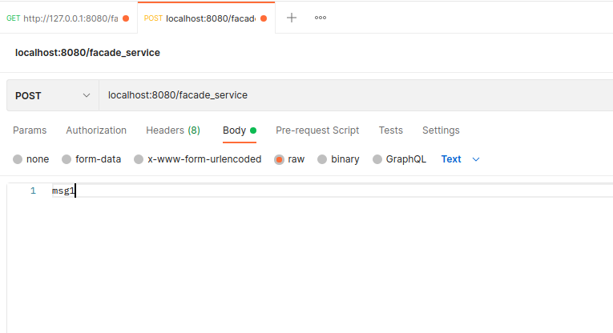
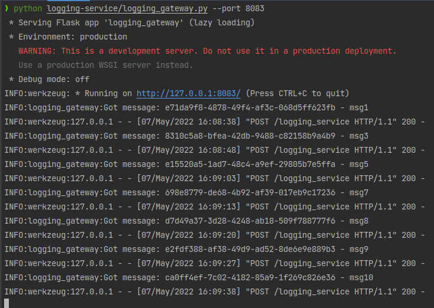
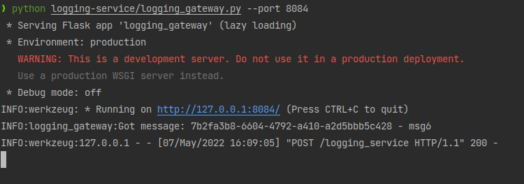
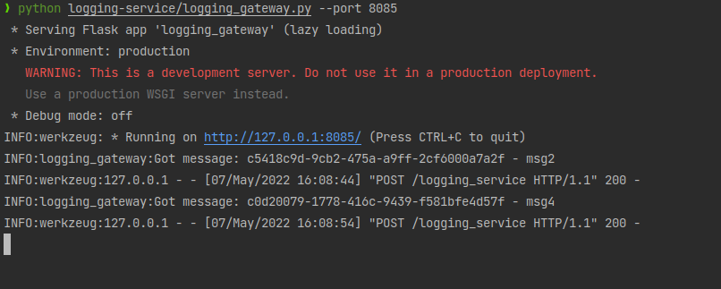
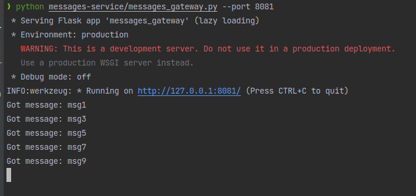
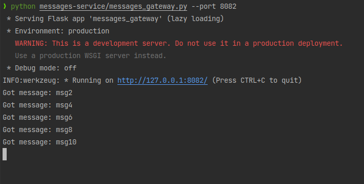
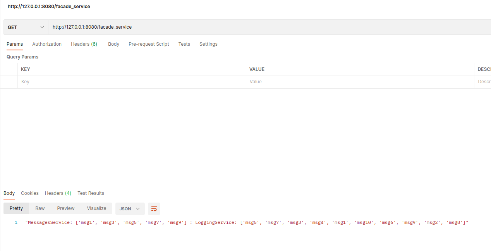
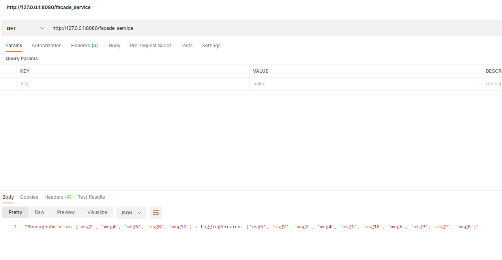

## Post request example

## Console logs after 10 requests
### logging_service_1

### logging_service_2

### logging_service_3

### messages_service_1

### messages_service_2

## Get requests:
### get_request_1

### get_request_2
