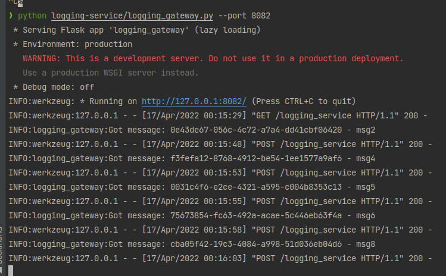
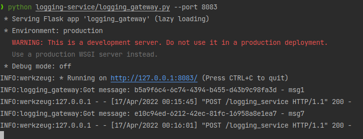
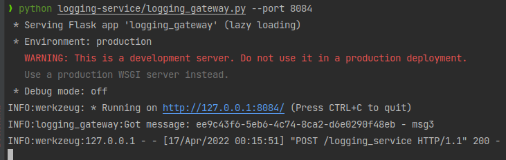
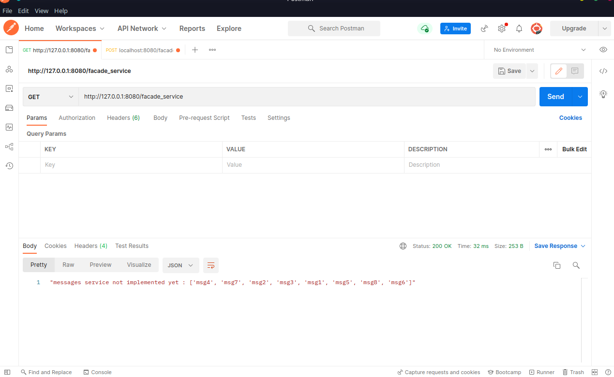
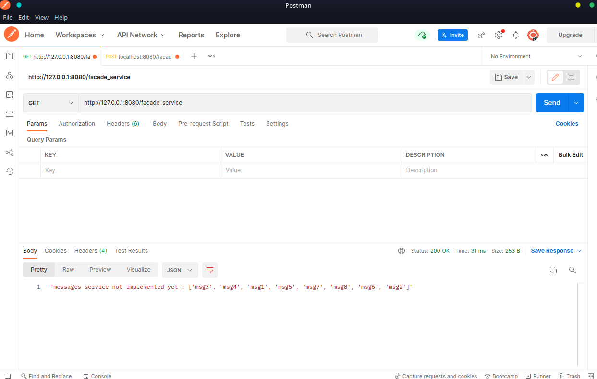
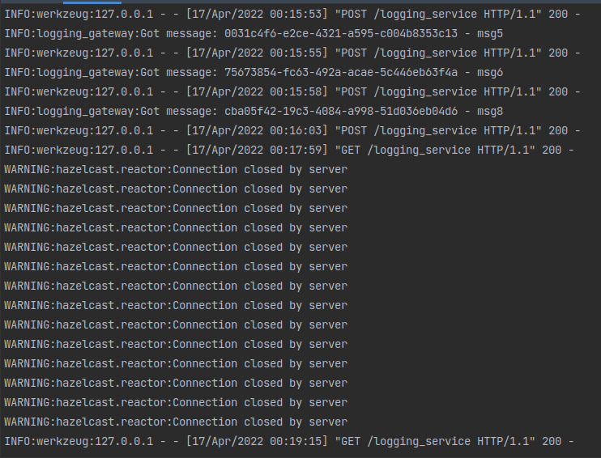

## Starting 3 instances of logging seervice and sending 8 messages
### logging_service_1

### logging_service_2

### logging_service_3

## Sending get request when all 3 nodes are alive

## Sending get request when 1 node is alive

## Console of last live node (can be seen the disconnection of other)
