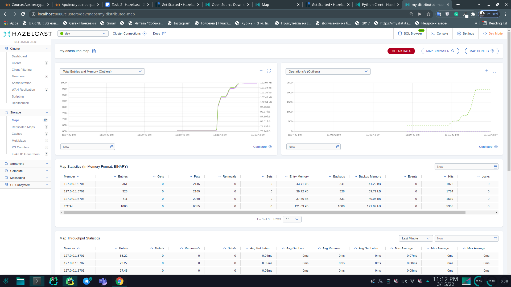

## Starting cluster 

## Map data distribution at start (1000 elements on 3 nodes)

## Map data distribution after node shutdown (1000 elements on 2 nodes)

## Test no locks, pessimistic lock and optimistic lock with time measurement (both locks work)

## Test bounded queue
